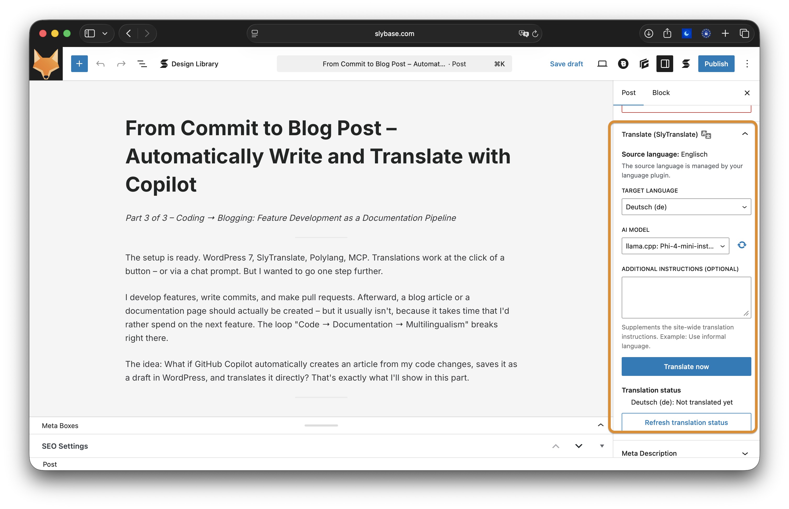
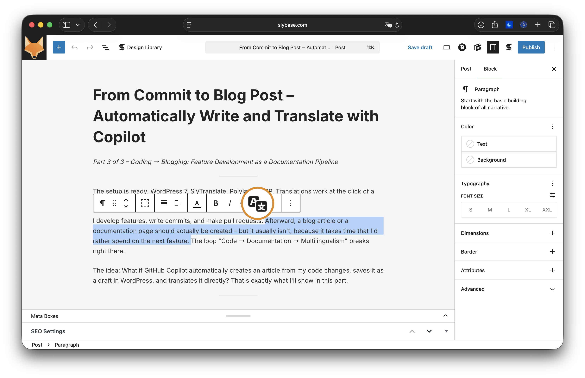
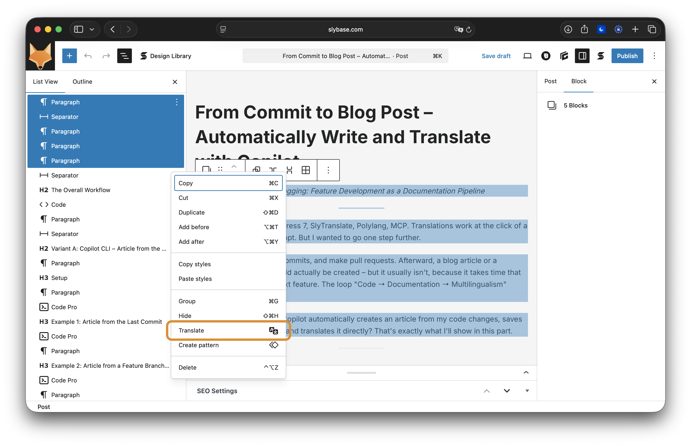
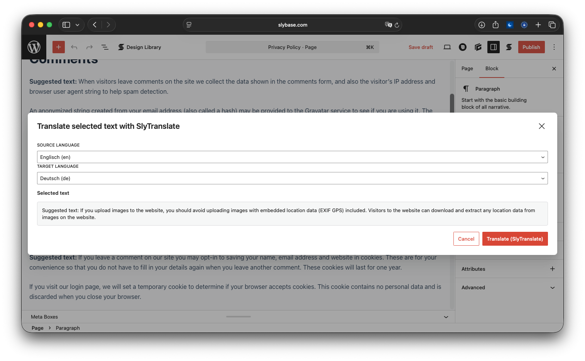
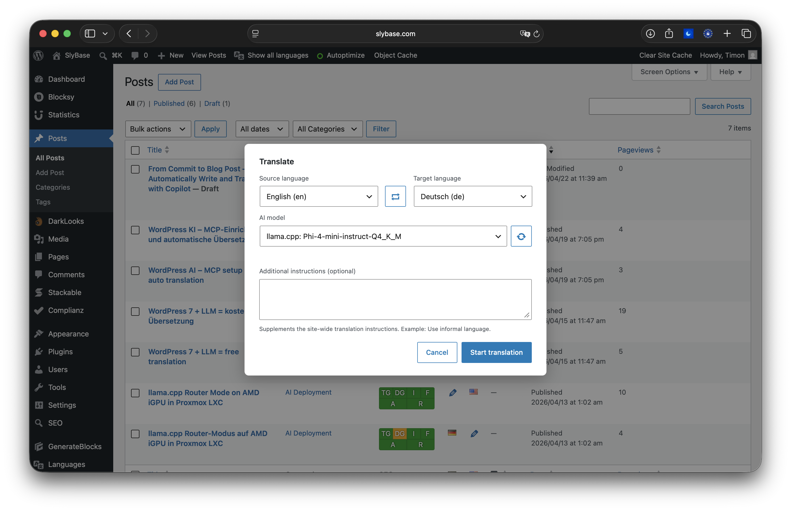

# SlyTranslate - AI Translation Abilities

SlyTranslate brings practical AI translation to WordPress 7. It is built for teams that need translation directly in editing workflows and also want the same workflows available through REST and MCP automation.

## Why this plugin?

Use SlyTranslate when you need one consistent translation workflow for:

- page/post translation in wp-admin
- inline selected-text translation in Gutenberg
- Gutenberg block translation
- bulk translation from list-table actions
- SEO title/description translation in the same process

## Screenshots

### 1) Panel UI in page/post

### 2) Inline translation

### 3) Gutenberg block translation

### 4) Page/post translation and bulk action

### 5) Translation UI overview

## Internal flow

- Uses native WordPress 7 AI connectors through `wp_ai_client_prompt()`.
- Registers translation workflows as WordPress Abilities.
- Exposes abilities over REST (`/wp-abilities/v1/`) and MCP discovery.
- Supports long/structured content with chunking and output validation.
- Optional `direct_api_url` supports OpenAI-compatible endpoints for model-specific payload needs.
- In WP Multilang mode, translation state is detected from language-specific content so placeholder titles do not count as completed translations.
- List-table translation now includes an explicit overwrite option with a confirmation step.

## Abilities

| Ability | Purpose |
| --- | --- |
| `ai-translate/get-languages` | List languages exposed by the active language plugin |
| `ai-translate/get-translation-status` | Show translation status for a content item, including `source_language` and `single_entry_mode` |
| `ai-translate/set-post-language` | Change the language assignment of an existing content item (only exposed when supported, e.g. Polylang) |
| `ai-translate/get-untranslated` | Find content still missing a target translation |
| `ai-translate/translate-text` | Translate arbitrary text |
| `ai-translate/translate-blocks` | Translate serialized Gutenberg blocks |
| `ai-translate/translate-content` | Create or update one translated post/page/CPT entry (call `get-translation-status` first; optional `source_language` + `overwrite`) |
| `ai-translate/translate-content-bulk` | Bulk-translate multiple entries (supports optional `source_language` and `overwrite`) |
| `ai-translate/get-progress` | Return live progress for a running translation |
| `ai-translate/cancel-translation` | Cancel a running translation |
| `ai-translate/get-available-models` | List models from configured connectors |
| `ai-translate/save-additional-prompt` | Save per-user additional instructions |
| `ai-translate/configure` | Read or update persistent plugin settings |

## Requirements

- WordPress 7.0+
- PHP 8.1+
- An AI connector configured in WordPress (Settings > Connectors)
- A supported language plugin (Polylang or WP Multilang) for content-translation workflows across posts/pages/CPTs
- WordPress MCP Adapter if you want MCP discovery

## Supported plugins

### Language plugin

- Polylang
- WP Multilang

### SEO plugins

- Genesis SEO
- Yoast SEO
- Rank Math
- All in One SEO
- The SEO Framework
- SEOpress
- Slim SEO

## Supported model profiles

- Standard LLMs: any model provided by active WordPress AI connectors.
- TranslateGemma: dedicated runtime with `chat_template_kwargs` support through `direct_api_url`.
- TowerInstruct: dedicated profile with bilingual framing, conservative chunking, and stricter retry behavior for German-target passthrough.

## Installation

1. Ensure WordPress 7.0+ and PHP 8.1+ are running.
2. Install and configure an AI connector in Settings > Connectors.
3. Optional for content translation: install and activate Polylang or WP Multilang.
4. Optional for local llama.cpp models: install AI Provider for llama.cpp.
5. Optional for other OpenAI-compatible local/self-hosted endpoints: install Ultimate AI Connector for Compatible Endpoints.
6. Optional for MCP discovery: install and activate WordPress MCP Adapter.
7. Copy the `slytranslate` directory to `/wp-content/plugins/`.
8. Activate SlyTranslate - AI Translation Abilities.

## FAQ

### Does this work without a language plugin?

Yes, for text and block translation (`translate-text`, `translate-blocks`, inline selected-text workflow). Content translation workflows require a supported language plugin (Polylang or WP Multilang).

### Where are API keys configured?

In WordPress Settings > Connectors, not inside SlyTranslate.

### Can I use bulk translation from post/page lists?

Yes. Use `translate-content-bulk` through abilities or the wp-admin list-table translation UI.

### How does overwriting existing translations work?

In the list-table dialog, **Overwrite existing translation** is off by default. If a translation already exists, you must enable overwrite and confirm before the translation starts.

### Can I change the language assignment of an existing post without running translation?

Yes, when the active language plugin supports language mutation (currently Polylang). In that case `ai-translate/set-post-language` is exposed and can be called with `post_id` and `target_language`. By default language conflicts fail with `language_conflict`; use `force` to opt in, and pass `relink=true` when translation relations should be rewritten. In WP Multilang mode this ability is not exposed.

### How do I control prompts and style?

Use `ai-translate/configure` for persistent defaults and `additional_prompt` on `translate-*` abilities for per-request instructions.

### Can I use TranslateGemma and TowerInstruct?

Yes. TranslateGemma uses the direct API runtime with `chat_template_kwargs`; TowerInstruct uses a dedicated model profile tuned for bilingual translation framing.
