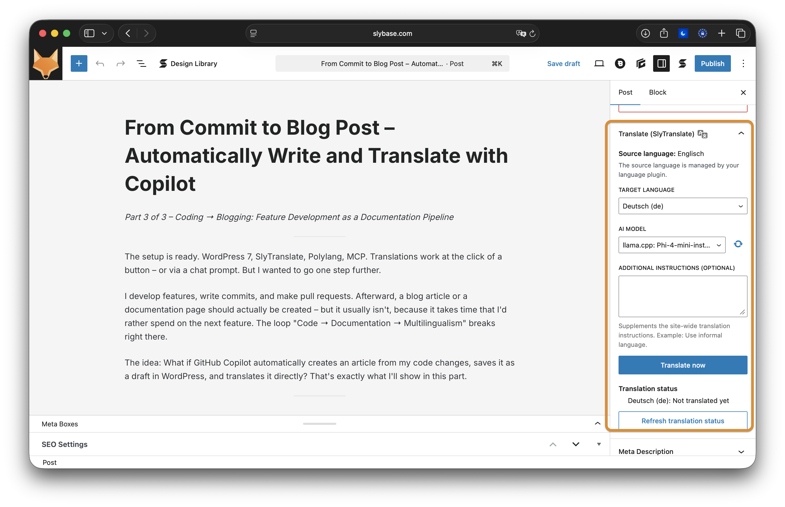
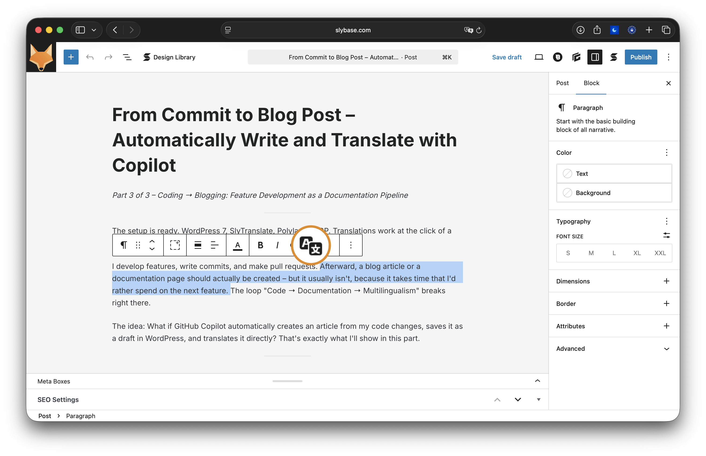
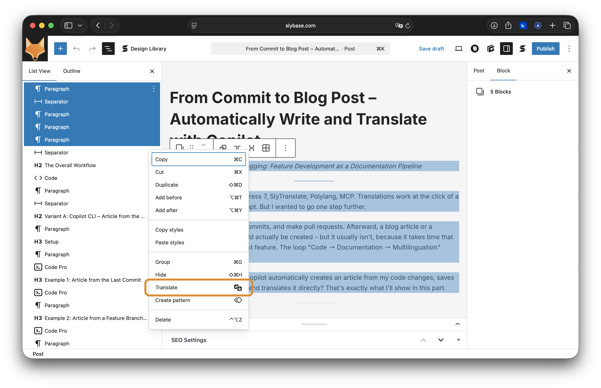
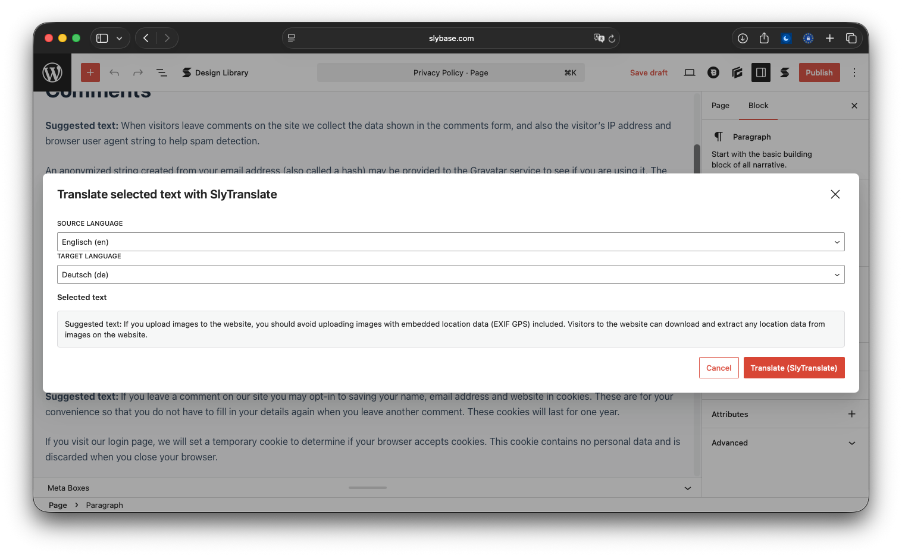
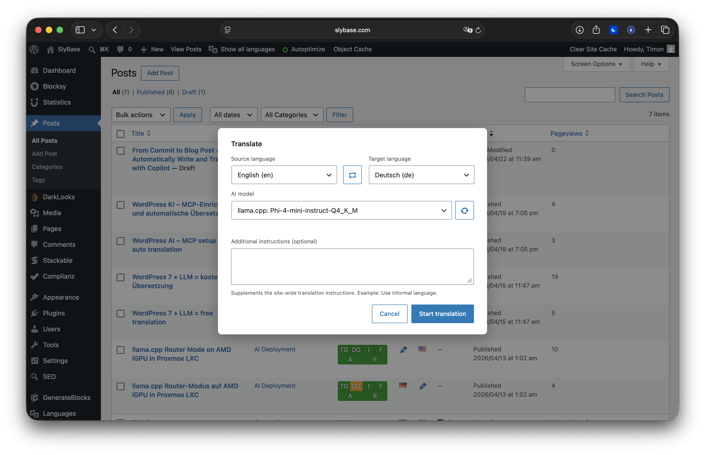
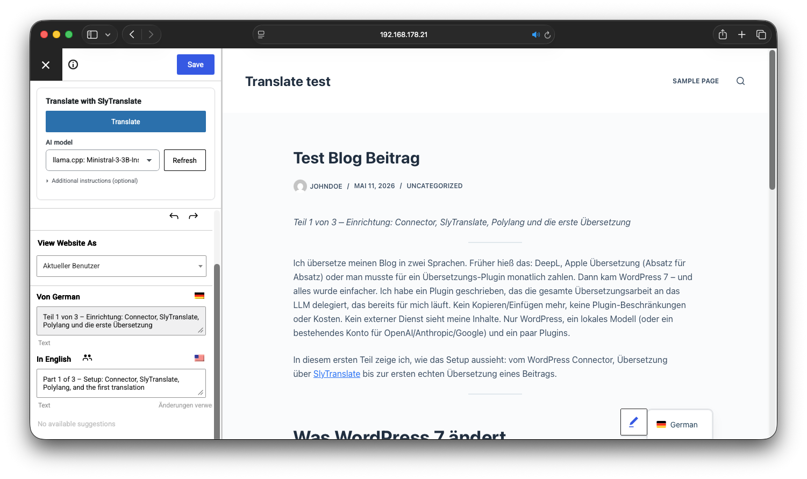

[](https://github.com/sponsors/slydlake)

# SlyTranslate — AI Translation for WordPress

SlyTranslate wires AI translation into WordPress at three different levels: the admin UI, the Gutenberg editor, and from external LLM tools via MCP. Whichever level you work at, the same language plugin integrations and translation quality controls apply.

It works with any LLM available through a WordPress AI connector and natively supports Polylang, WP Multilang, WPGlobus, and TranslatePress Multilingual.

---

## What it does

- Translates posts, pages, and custom post types into any language managed by your active language plugin
- Translates selected text or entire Gutenberg blocks inline, without leaving the editor
- Exposes the same functionality as MCP abilities, so external LLM tools (Claude Code, Codex, and others) can drive translations programmatically
- Carries SEO metadata (title, description) through the same translation workflow as the post content
- Handles long and structured content with chunking and output validation
- Supports model-specific profiles that tune prompt style and retry behavior for known model families

---

## Three ways to use it

### 1 — Admin UI translation (posts & pages overview, side panel)

Translate full posts or pages directly inside WordPress admin — either one at a time from the editor side panel or in bulk from the list view.

```
Requirements: language plugin + configured AI Connector
```

From the **post/page list**, select one or more items and choose a translation action from the bulk-actions menu. A dialog lets you pick target language, model, and whether to overwrite existing translations. Progress updates live while the translation runs, and you can cancel at any time.

From the **editor side panel**, the same controls appear alongside the post you are currently editing. TranslatePress users get an equivalent panel inside the TranslatePress visual editor on `?trp-edit-translation` pages.

The language plugin (Polylang, WP Multilang, WPGlobus, or TranslatePress) handles the translated post as it normally would — SlyTranslate creates or updates the translated entry and lets the language plugin own the relationship.

---

### 2 — Inline Gutenberg translation (block or selected text)

Translate content while writing, without touching a language plugin or a full-post workflow.

```
Requirements: configured AI Connector
```

Select any text in a Gutenberg block and the block toolbar gains a **Translate** button. The selected text is replaced with the translation in place. When no text is selected, the button translates the entire block.

This workflow is self-contained: it does not require a language plugin and does not create or modify translated post entries. It is useful for one-off corrections, translating imported content on the fly, or working in a single-language site where you just need AI rewriting in another language.

---

### 3 — LLM wrapper via MCP (Claude Code, Codex, and others)

Drive WordPress translations from inside your LLM tool of choice.

```
Requirements: language plugin + WordPress application password (token)
WordPress MCP Adapter plugin to expose the MCP endpoint
```

When a WordPress MCP Adapter is active, SlyTranslate registers its abilities over MCP. Any MCP-capable LLM client — Claude Code, Codex, custom agents — can then discover and call them.

In this workflow **the LLM wrapper provides the translation itself**. SlyTranslate's MCP abilities handle the WordPress side: reading content structure, checking translation status, writing translated entries, and coordinating with the language plugin. No WordPress AI Connector is needed because translation is performed by the external model, not by WordPress.

A typical agent session looks like:

1. Call `ai-translate/get-languages` to find valid target language codes.
2. Call `ai-translate/get-translation-status` on the source post to read `source_language` and `single_entry_mode`.
3. Translate the content using the agent's own LLM.
4. Call `ai-translate/translate-content` to write the translated entry.

This is the right workflow for automating bulk site migrations, integrating translation into a CI/CD pipeline, or building a custom translation agent that uses a model not available as a WordPress AI connector.

---

## Internal flow

```
  ┌──────────────────┐   ┌───────────────────┐   ┌────────────────────────┐
  │    Admin UI      │   │    Gutenberg       │   │   LLM Wrapper          │
  │  (panel / list)  │   │ (block / toolbar)  │   │ (Claude Code, Codex…)  │
  └────────┬─────────┘   └────────┬──────────┘   └──────────┬─────────────┘
           │ REST                 │ REST                     │ MCP
           └──────────────────────┴──────────────────────────┘
                                          │
                               ┌──────────▼──────────────┐
                               │  SlyTranslate  Ability  │
                               │  (REST / MCP endpoint)  │
                               └──────────┬──────────────┘
                                          │
                              ┌───────────▼───────────┐
                              │     AI Connector      │  ← only for UI/
                              │  (wp_ai_client_prompt)│    block workflows
                              └───────────┬───────────┘
                                          │
                              ┌───────────▼───────────┐
                              │   LLM (any provider)  │
                              └───────────┬───────────┘
                                          │
                              ┌───────────▼───────────┐
                              │  Chunk + Validate     │
                              │  output               │
                              └───────────┬───────────┘
                                          │
                              ┌───────────▼───────────┐
                              │   Language Plugin     │
                              │  Polylang / TP / …    │
                              └───────────┬───────────┘
                                          │
                              ┌───────────▼───────────┐
                              │   WordPress Post      │
                              └───────────────────────┘
```

In the MCP workflow the LLM Wrapper box at the top also acts as the translation engine — the AI Connector and LLM steps inside WordPress are bypassed.

---

## Abilities reference

| Ability | Purpose |
| --- | --- |
| `ai-translate/get-languages` | List languages exposed by the active language plugin |
| `ai-translate/get-translation-status` | Show translation status for a content item, including `source_language` and `single_entry_mode` |
| `ai-translate/set-post-language` | Change the language assignment of an existing content item (Polylang only) |
| `ai-translate/get-untranslated` | Find content still missing a target translation |
| `ai-translate/translate-text` | Translate arbitrary text |
| `ai-translate/translate-blocks` | Translate serialized Gutenberg blocks |
| `ai-translate/translate-content` | Create or update one translated post/page/CPT entry |
| `ai-translate/translate-content-bulk` | Bulk-translate multiple entries |
| `ai-translate/get-progress` | Return live progress for a running translation |
| `ai-translate/cancel-translation` | Cancel a running translation |
| `ai-translate/get-available-models` | List models from configured connectors |
| `ai-translate/save-additional-prompt` | Save per-user additional instructions |
| `ai-translate/configure` | Read or update persistent plugin settings |

### MCP call sequence

For reliable results in agent workflows:

- Call `get-languages` first when the correct target language code is unknown.
- Call `get-translation-status` before `translate-content` to read `source_language`, `single_entry_mode`, and whether a translation already exists.
- Omit `source_language` unless you intentionally pin a source variant.
- Set `overwrite=true` only when status or prior context confirms a target-language entry already exists.
- `translated_post_id` equals `source_post_id` in single-entry adapters (WP Multilang, WPGlobus, TranslatePress). In multi-post adapters (Polylang) the translated item has a sibling post ID.

---

## Requirements

- WordPress 6.9+
- PHP 8.1+
- An AI connector configured in WordPress (Settings > Connectors) — required for UI and Gutenberg workflows
- A supported language plugin for content-translation workflows across posts/pages/CPTs
- WordPress MCP Adapter if you want MCP discovery for LLM wrapper workflows

---

## Supported plugins

**Language plugins**

- Polylang
- WP Multilang
- WPGlobus
- TranslatePress Multilingual

**SEO plugins** (metadata translated alongside content)

- Genesis SEO
- Yoast SEO
- Rank Math
- All in One SEO
- The SEO Framework
- SEOpress
- Slim SEO

---

## Supported model profiles

Any LLM available through a WordPress AI connector works without configuration. The following model families have dedicated built-in profiles that tune prompt style, chunking, and retry behavior:

- **TranslateGemma** — dedicated runtime with `chat_template_kwargs` support via `direct_api_url`
- **TowerInstruct / Salamandra** — bilingual framing, conservative chunking, stricter retries
- **Nvidia Nemotron** — system-prompt-aware, reasoning-disable, provider-parameter forwarding
- **Qwen 3.x / GLM-4.6v / Gemma 4 / Phi-4** — thinking-aware profiles
- **EuroLLM / Llama 3.1-8B / SauerkrautLM** — conservative chunking tuned for European languages
- **Ministral-3 / Ministral-8B** — optimized for the Ministral model family

Additional profiles can be registered via the `slytranslate_model_profiles` filter.

---

## Installation

**Via WordPress Plugin Directory (recommended)**

1. Ensure WordPress 6.9+ and PHP 8.1+ are running.
2. In wp-admin, go to Plugins > Add New and search for "SlyTranslate".
3. Install and activate SlyTranslate.
4. Install and configure an AI connector in Settings > Connectors.
5. Optional for content translation: install and activate Polylang, WP Multilang, WPGlobus, or TranslatePress Multilingual.
6. Optional for local llama.cpp models: install AI Provider for llama.cpp.
7. Optional for other OpenAI-compatible local/self-hosted endpoints: install Ultimate AI Connector for Compatible Endpoints.
8. Optional for MCP discovery: install and activate WordPress MCP Adapter.

**Manual installation**

1. Ensure WordPress 6.9+ and PHP 8.1+ are running.
2. Copy the `slytranslate` directory to `/wp-content/plugins/`.
3. Activate SlyTranslate in wp-admin.
4. Configure an AI connector in Settings > Connectors.
5. Optional steps same as above.

---

## FAQ

**Does this work without a language plugin?**
Yes, for inline text and block translation. Content translation workflows (full post/page) require a supported language plugin.

**Where are API keys configured?**
In WordPress Settings > Connectors, not inside SlyTranslate.

**Can I run bulk translation from the post/page list?**
Yes. Select items in wp-admin, pick the bulk translation action, choose language and model, and confirm.

**Does this work inside the TranslatePress visual editor?**
Yes. On pages opened with `?trp-edit-translation=true`, SlyTranslate adds a sidebar panel with the same model, overwrite, progress, and cancel controls used elsewhere.

**How does overwriting existing translations work?**
In the list-table dialog, overwrite is off by default. If a translation already exists you must enable it and confirm before the translation starts.

**Can I change a post's language without re-translating?**
Yes, when using Polylang. Call `ai-translate/set-post-language` with `post_id` and `target_language`. Use `force` to bypass conflict checks and `relink=true` to rewrite translation relations. Not available in WP Multilang mode.

**How do I control the prompt and translation style?**
Use `ai-translate/configure` for persistent defaults. Pass `additional_prompt` on any `translate-*` call for per-request instructions.

**Why does `execute-ability` fail even when discovery looks correct?**
Some external WordPress MCP adapter wrappers expose a flatter `execute-ability` signature. If `discover-abilities` shows the correct SlyTranslate schema but `execute-ability` still errors about a missing `parameters` wrapper, investigate the external adapter layer — SlyTranslate controls ability names, descriptions, and schemas, not the wrapper surface.

---

## Screenshots

### 1) Side panel in post/page editor



### 2) Inline text translation



### 3) Gutenberg block translation



### 4) Post/page list with bulk translation action



### 5) Translation UI overview



### 6) TranslatePress visual editor addon


